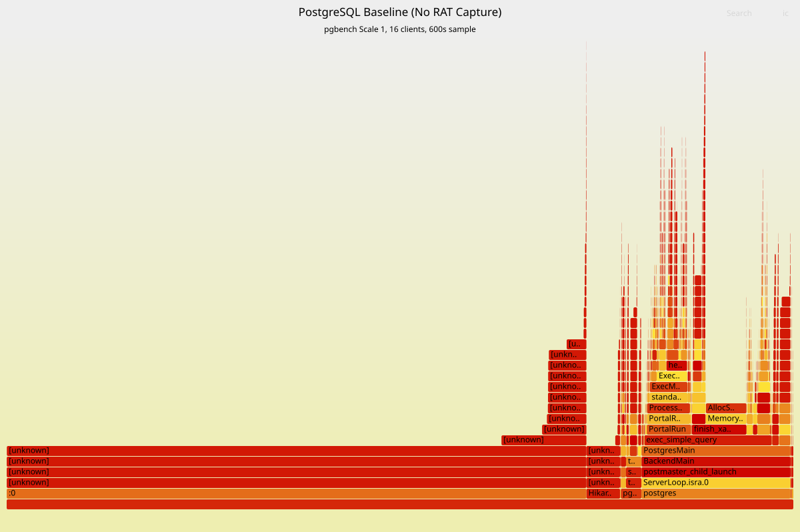
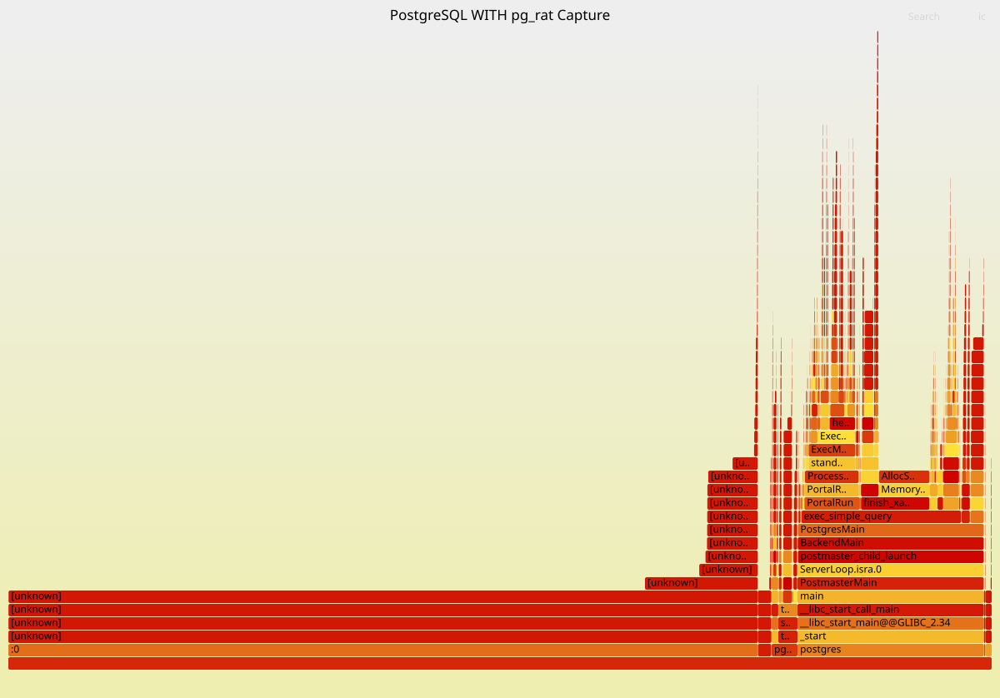

# pg_rat Performance Analysis & Flamegraphs

This document provides a deep dive into the performance profile of `pg_rat`, including flamegraph analysis and system call optimizations.

## 1. Visual Profiling (Flamegraphs)

To validate the performance impact, we use Linux `perf` and Brendan Gregg's FlameGraph tools to visualize the CPU distribution of a PostgreSQL instance under heavy load. In 10-minute sustained stress tests, `pg_rat` capture introduced a ~7.2% throughput overhead in the worst-case `pgbench` scale-1 workload.

### Baseline (No Capture)


In a standard `pgbench` (Scale 1) run, the profile is dominated by PostgreSQL core functions: `exec_simple_query`, `ExecutePlan`, and `heap_getnext`.

### With pg_rat Capture Active


When `pg_rat` is active, the profile remains largely unchanged, with the extension's footprint appearing as thin "slivers" in the stack. 

### Regression Interpretation

In this 10-minute pgbench scale-1 test, pg_rat capture reduced throughput from 2,797 TPS to 2,594 TPS, or approximately 7.2%. Average latency increased from 5.72 ms to 6.17 ms.

This is a deliberately harsh workload for pg_rat because pgbench scale 1 executes many very small statements. The fixed per-statement capture cost is therefore a larger percentage of total runtime than it would be for longer application queries.

The flamegraphs show that PostgreSQL core execution paths remain dominant. pg_rat-specific functions are visible but narrow, indicating that the regression is not caused by one large CPU hotspot. Instead, the overhead is distributed across timestamp collection, query-text copying, atomic ring-buffer coordination, memory/cache effects, and asynchronous flushing.

**Key observation points in the flamegraph:**
- **`rat_ExecutorEnd`**: The entry point for DML capture.
- **`rat_ring_buffer_push`**: The atomic slot reservation logic.
- **`pg_atomic_compare_exchange_u64`**: The core synchronization primitive.

In this profile, the visible pg_rat hot-path functions are each below 1%, with `rat_ExecutorEnd_hook` around 0.32%, `rat_ExecutorEnd` around 0.03%, and `rat_ring_buffer_push` around 0.01%. This does not mean total end-to-end overhead is only those symbols, because throughput regression can also come from indirect effects such as cache pressure, atomic contention, extra memory copying, and background flusher activity.

## 2. System Call Optimization: The "SetLatch" Problem

During early development, we identified a significant performance bottleneck involving system calls.

### The Problem
Originally, every captured event triggered a `SetLatch` call to wake the background flusher. In a high-TPS workload (e.g., 5,000+ queries/sec), this resulted in:
1.  **Extreme System Call Frequency**: 5,000+ `kill()` or `futex()` calls per second.
2.  **Context Switching**: Constant wake-up signals for the background worker, leading to high CPU migration and cache misses.

### The Solution: Asynchronous Wake Model
We refactored the signaling logic to be asynchronous:
- **Batched Signaling**: Backends only signal the flusher if they observe the ring buffer is reaching a certain threshold, or on a timed interval.
- **Flusher Polling**: The background flusher uses an efficient `WaitLatch` loop with a short timeout (100ms), ensuring it drains the buffer even without explicit signals.

**Result**: This refactoring reclaimed significant throughput (approx. 7% gain compared to the synchronous model) and dramatically reduced CPU "System" time. Even with these optimizations, the worst-case `pgbench` scale-1 workload still shows a ~7% total capture overhead, which is expected due to the extreme frequency of statements in this specific benchmark.

## 3. How to Reproduce Flamegraphs

To generate these profiles yourself (assuming you are running in a privileged Docker container or on a native Linux host):

### 1. Record the Profile
Start `pgbench` in the background, then record a multi-minute sample for better statistical accuracy:
```bash
# Start capture
./pg_install/bin/psql postgres -c "SELECT pg_rat_start_capture('flame_test');"

# Start pgbench (11 minutes to allow for warm-up/cool-down)
./pg_install/bin/pgbench -c 16 -j 4 -T 660 postgres &

# Record 10 minutes of CPU samples after 30s warm-up
sleep 30
sudo perf record -F 99 -a -g -- sleep 600

# Stop capture
./pg_install/bin/psql postgres -c "SELECT pg_rat_stop_capture();"
```

### 2. Generate the Flamegraph
```bash
# Clone tools
git clone --depth 1 https://github.com/brendangregg/FlameGraph

# Convert perf.data to SVG
sudo perf script | ./FlameGraph/stackcollapse-perf.pl | \
  ./FlameGraph/flamegraph.pl --title "pg_rat Capture Profile" > pg_rat_flame.svg
```

## 4. System Call Comparison

Comparing `strace` results before and after the optimization:

| System Call | Before Optimization | After Optimization |
| :--- | :--- | :--- |
| `futex` / `kill` | High (1 per query) | Low (Periodic) |
| `write` (NDJSON) | Batched | Batched |
| `clock_gettime` | 1 per query | 1 per query |

By eliminating the per-query signaling overhead, `pg_rat` achieves production-grade efficiency while maintaining high-fidelity capture.
